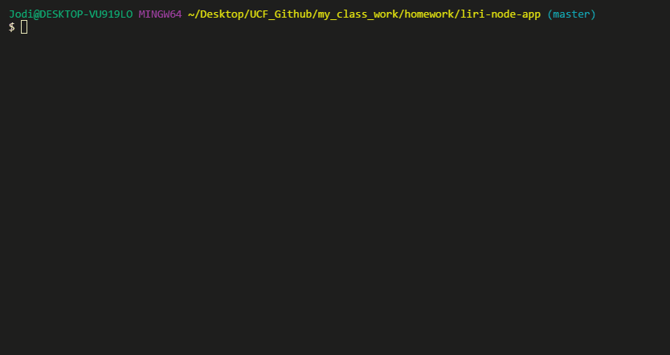
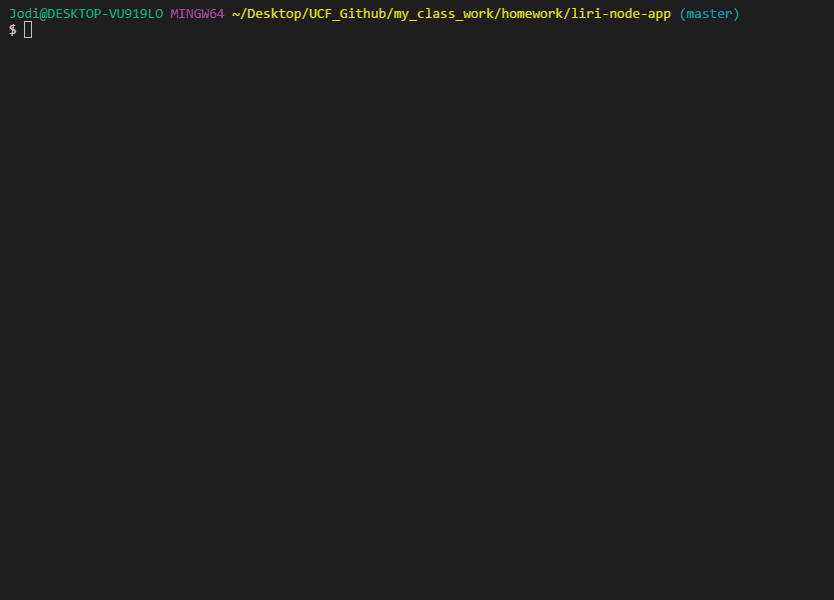
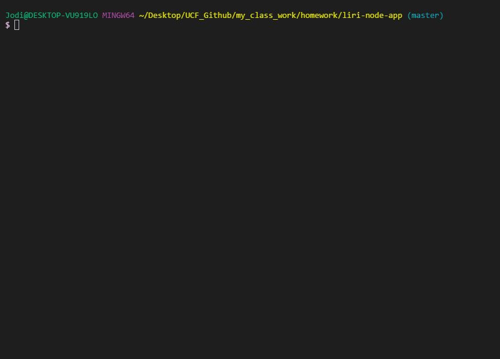
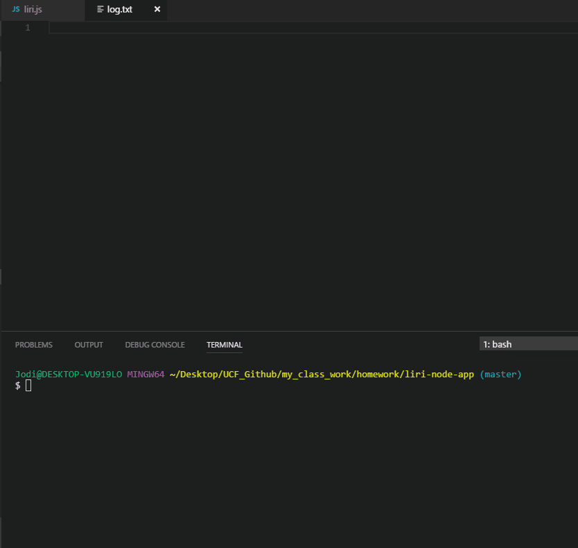

# Liri Bot

Choose from the following commands:

### my-tweets

This will show the most recent 20 tweets from a specified Twitter account

### spotify-this-song

This command will return information about the song you enter.  If you do not enter a song title, the information for The Sign by Ace of Base will be displayed.

### movie-this

Choosing movie-this will show you movie details about the film name you have entered.  If you do not enter a movie title, you will see the information for Mr. Nobody

### do-what-it-says

This command will pull instructions from an external txt file and perform that command.  In this case, it is set to spotify I Want It That Way

### all commands are logged

Upon execution of each command, the results are logged to a log.txt file

